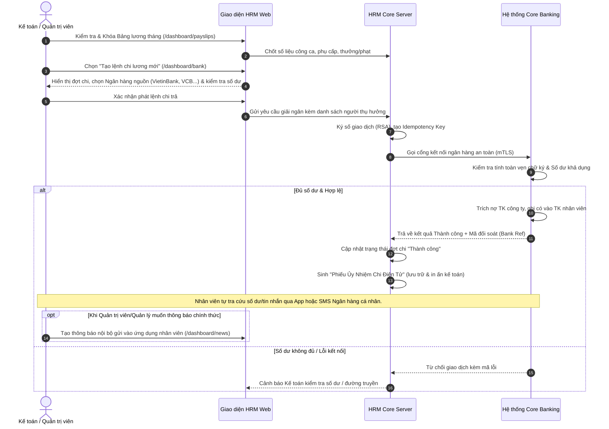

# TÀI LIỆU ĐẶC TẢ NGHIỆP VỤ: KẾT NỐI NGÂN HÀNG & CHI LƯƠNG TỰ ĐỘNG (ON-PREMISES SOA)

> **Dự án**: Hệ thống Quản trị Nhân sự & Vận hành Ca kíp Chuỗi (HRM Enterprise System)  
> **Mô hình triển khai**: On-Premises SOA (Cài đặt trên hạ tầng Server riêng của Doanh nghiệp)  
> **Phiên bản**: 2.0  
> **Ngày cập nhật**: 17/09/2026  

---

## 📌 1. Bối cảnh & Mục tiêu Nghiệp vụ

### 1.1. Thực trạng trước khi tích hợp
- **Thủ công & Tốn thời gian**: Mỗi kỳ chi lương, phòng Nhân sự và Kế toán phải xuất file Excel từ phần mềm HRM $\rightarrow$ định dạng lại theo mẫu bảng kê của từng ngân hàng $\rightarrow$ Kế toán viên đăng nhập Internet Banking $\rightarrow$ Tải file lên $\rightarrow$ Kế toán trưởng duyệt OTP $\rightarrow$ Chờ ngân hàng xử lý từng lệnh.
- **Rủi ro sai lệch số liệu**: Dễ nhầm lẫn số tài khoản, số tiền, sót nhân viên làm việc thời vụ hoặc nhân sự mới.
- **Thiếu tức thì & Chậm đối soát**: Mất nhiều giờ (thậm chí qua ngày) tiền mới về tài khoản nhân viên, khó tra cứu chứng từ chi tiết khi xảy ra khiếu nại lương.

### 1.2. Mục tiêu chuyển đổi
- **1-Click Chi lương Trực tiếp**: Bấm nút tạo lệnh trực tiếp trên giao diện HRM, tiền được chuyển thẳng từ tài khoản doanh nghiệp vào tài khoản nhân viên trong vài giây.
- **Khép kín & Tự động hóa**: Bảng lương chốt $\rightarrow$ Lệnh chi trực tiếp sang Core Banking $\rightarrow$ Ngân hàng hạch toán thành công $\rightarrow$ Tự động sinh Ủy nhiệm chi điện tử lưu trữ và đối soát kế toán.
- **Phân định rõ ràng trách nhiệm thông báo**: 
  - **Không tự động bắn thông báo mobile khi chuyển tiền qua API**: Tránh rủi ro thông báo trước khi tiền thực tế vào tài khoản nhân viên (độ trễ liên ngân hàng NAPAS hoặc nghẽn mạng). Nhân viên tự theo dõi biến động số dư qua dịch vụ SMS Banking / App ngân hàng cá nhân của mình.
  - **Thông báo nội bộ do Admin/Manager chủ động**: Khi cần thông báo chung về kỳ lương, Admin hoặc Quản lý chi nhánh sẽ chủ động tạo bản tin trên phân hệ **Bảng tin & Thông báo** (`/dashboard/news`) để gửi đến toàn thể nhân sự.
- **Giao diện thân thiện**: Được thiết kế tinh giản cho người dùng quản trị/kế toán doanh nghiệp, ẩn đi các thuật ngữ kỹ thuật phức tạp nhưng vẫn đảm bảo tính chính xác và an toàn tuyệt đối.

---

## 🏗️ 2. Kiến trúc Tích hợp (On-Premises SOA)

```
┌────────────────────────────────────────────────────────────────┐
│             HẠ TẦNG NỘI BỘ DOANH NGHIỆP (ON-PREMISES)          │
│                                                                │
│   ┌─────────────────────┐                                      │
│   │   Web HRM Portal    │                                      │
│   │  (Admin / Manager)  │                                      │
│   └──────────┬──────────┘                                      │
│              │ (HTTPS)                                         │
│   ┌──────────▼──────────────────────────────────────────────┐  │
│   │             HRM Core Server (SOA Gateway)               │  │
│   │      - Module Bảng lương (Payroll Calculation)          │  │
│   │      - Quản lý tài khoản ngân hàng & số dư              │  │
│   │      - Bộ ký số giao dịch (RSA-SHA256 Signer)           │  │
│   └──────────────────────────┬──────────────────────────────┘  │
└──────────────────────────────┼─────────────────────────────────┘
                               │
            Kênh truyền bảo mật nội bộ (Leased Line / VPN IPsec)
            Giao thức HTTPS mTLS (Mutual TLS X.509)
            Chữ ký số XML WS-Security (SOAP API)
                               │
┌──────────────────────────────▼─────────────────────────────────┐
│                 CORE BANKING HỆ THỐNG NGÂN HÀNG                 │
│              (VietinBank / Vietcombank / BIDV / ...)           │
│                                                                │
│   - Nhận diện doanh nghiệp qua Certificate & API Key           │
│   - Trích nợ tài khoản công ty (Direct Debit)                  │
│   - Ghi có tự động vào TK nhân viên (Nội mạng / NAPAS 247)     │
│   - Sinh Mã đối soát giao dịch (Bank Reference ID)             │
└────────────────────────────────────────────────────────────────┘
```

- **Tính độc lập (Single-Tenant)**: Phần mềm và cơ sở dữ liệu được cài đặt trọn vẹn trên máy chủ riêng của doanh nghiệp. Tuyệt đối không qua bên thứ ba (trung gian thanh toán SaaS) nhằm bảo vệ 100% bí mật bảng lương và tài chính doanh nghiệp.
- **Kênh truyền ngân hàng an toàn**: Ngân hàng cung cấp cổng kết nối trực tiếp (Direct Host-to-Host / Corporate SOAP Gateway) với đường truyền chuyên dụng hoặc VPN IPsec kèm chữ ký số x509 hai chiều.

---

## 🔄 3. Quy trình Nghiệp vụ Chi tiết (End-to-End Workflow)



---

## 📋 4. Các Chức năng Nghiệp vụ Chính

### 4.1. Tổng quan Số dư & Trạng thái Cổng kết nối
- **Theo dõi Tài khoản Doanh nghiệp**: Hiển thị tên ngân hàng, số tài khoản doanh nghiệp, số dư khả dụng cập nhật trực tiếp theo thời gian thực.
- **Tài khoản mặc định (Primary)**: Doanh nghiệp có thể thiết lập tài khoản chính để hệ thống tự động trích nợ khi chi lương.
- **Kiểm tra đường truyền (Health Check)**: Nút bấm kiểm tra độ trễ kết nối (Latency ms), chứng thư số SSL/TLS và tình trạng sẵn sàng của hệ thống ngân hàng đối tác.

### 4.2. Tạo Lệnh Chi lương Mới
- Cho phép lựa chọn:
  1. **Đợt chi lương**: Chi lương định kỳ (toàn công ty hoặc theo chi nhánh), Chi lương tăng cường, hoặc Chi tạm ứng lương.
  2. **Tài khoản trích nợ**: Chọn ngân hàng nguồn chi trả (VietinBank Corporate, Vietcombank...).
  3. **Nội dung thanh toán**: Mẫu chuẩn doanh nghiệp (Ví dụ: `CÔNG TY HRM CHI TRA TIEN LUONG THANG 08/2026`).
- **Tự động đối soát trước khi chi**:
  - Đối chiếu tổng số tiền cần chi trả với số dư khả dụng hiện tại.
  - Cảnh báo nếu số tài khoản nhân viên nào bị thiếu hoặc sai định dạng ngân hàng.

### 4.3. Bảng Kê Lịch sử Chi lương & Phiếu Ủy Nhiệm Chi Điện Tử
- **Lịch sử giao dịch**:
  - Mã giao dịch nội bộ (`TXN-...`).
  - Mã đối soát ngân hàng (`Bank Reference`).
  - Tên đợt chi lương, số lượng nhân sự thụ hưởng, tổng tiền giải ngân.
  - Trạng thái xử lý: **Thành công**, **Đang xử lý**, hoặc **Thất bại**.
- **Phiếu Ủy Nhiệm Chi Điện Tử (Chứng từ Ngân hàng)**:
  - Khi bấm xem chi tiết, hệ thống hiển thị mô phỏng một **Phiếu Ủy Nhiệm Chi** chuẩn mực ngân hàng.
  - Có mộc đỏ/xanh điện tử: `ĐÃ TRÍCH NỢ THÀNH CÔNG`.
  - Thông tin đơn vị trả tiền (Doanh nghiệp, STK, Ngân hàng trích nợ).
  - Bảng kê chi tiết đơn vị thụ hưởng (Nhân viên, Ngân hàng, STK, Số tiền bằng số và bằng chữ).
  - Tích hợp nút **"In chứng từ"** (`window.print()`) phục vụ lưu trữ kế toán và nộp cơ quan thuế.

### 4.4. Chi Tạm Ứng Lương Tức Thì
- Nhân viên gửi đơn xin tạm ứng lương trên Mobile $\rightarrow$ Quản lý/Ban Giám đốc phê duyệt $\rightarrow$ Kế toán bấm giải ngân tạm ứng $\rightarrow$ Tiền chuyển thẳng vào tài khoản nhân viên theo đúng hạn mức được duyệt.

---

## 🔒 5. Cơ chế Bảo mật & Quản lý Rủi ro Tài chính

| Tiêu chuẩn / Rủi ro | Giải pháp Công nghệ & Nghiệp vụ |
|---|---|
| **Chống chuyển tiền trùng lặp (Double Spending)** | Sử dụng **Idempotency Key** duy nhất cho từng đợt chi. Nếu đường truyền gặp sự cố ngắt giữa chừng, việc gửi lại lệnh với cùng mã khóa sẽ không bị ngân hàng trích nợ 2 lần. |
| **Bảo vệ tính toàn vẹn dữ liệu** | Mỗi payload chi lương đều được băm SHA-256 và ký điện tử (Digital Signature) bằng chứng thư bảo mật riêng của doanh nghiệp. |
| **Xác thực kết nối 2 chiều (mTLS)** | Máy chủ doanh nghiệp và máy chủ Ngân hàng chỉ trao đổi dữ liệu khi cả 2 bên xác thực chứng chỉ số X.509 hợp lệ. |
| **Nhật ký kiểm toán (Audit Trail)** | Mọi thao tác tạo lệnh, phê duyệt, gửi lệnh, kết quả đối soát đều được ghi log bất biến có timestamp, IP và người thực hiện. |
| **Xử lý tài khoản nhân viên bị lỗi** | Trường hợp nhân viên đóng tài khoản hoặc sai số tài khoản, hệ thống Core Banking sẽ tự động hoàn tiền (Refund) khoản đó về tài khoản công ty và gửi thông báo lỗi chi tiết. |

---

## 👥 6. Phân quyền Người dùng (RBAC) đối với Phân hệ Ngân hàng

- **Quản trị viên (Admin / Giám đốc)**:
  - Xem toàn bộ danh sách tài khoản doanh nghiệp và số dư.
  - Quyền phê duyệt và bấm lệnh phát chi lương toàn công ty.
  - Thêm, sửa, thiết lập tài khoản ngân hàng nguồn mặc định.
- **Quản lý Chi nhánh (Branch Manager)**:
  - Xem danh sách và lịch sử giải ngân của nhân sự thuộc chi nhánh phụ trách.
  - Không có quyền thay đổi cấu hình tài khoản ngân hàng doanh nghiệp.
- **Nhân viên (Staff)**:
  - Không truy cập phân hệ Ngân hàng.
  - Tự chủ động theo dõi biến động số dư qua SMS Banking hoặc ứng dụng Ngân hàng cá nhân; xem phiếu lương chi tiết trên ứng dụng Mobile.
  - Nhận các thông báo chung về kỳ lương nếu Admin hoặc Quản lý chi nhánh chủ động đăng trên Bảng tin công ty.
